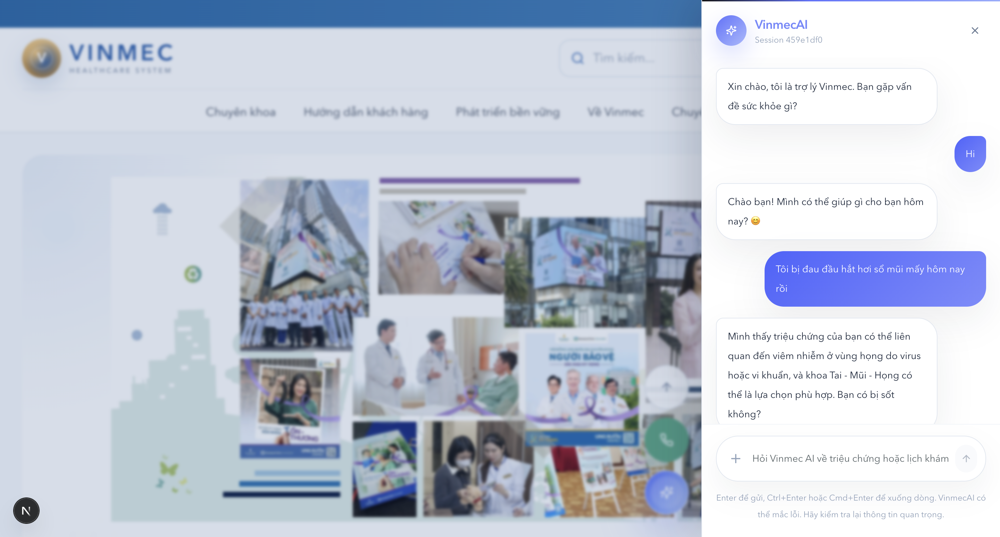

# Nhóm X10 — AI Medical Triage & Booking System



Chào mừng đến với dự án của Nhóm X10 (C401) tham gia **AI Product Hackathon**. Đây là một hệ thống chatbot y tế thông minh giúp phân loại chuyên khoa và đặt lịch khám tự động.


---

## 📂 Cấu trúc Repository (Nộp bài)

Hồ sơ nộp bài chính thức được tổ chức như sau:

*   **`group/`**: Tài liệu chung của nhóm.
    *   `spec-final.md`: Bản đặc tả sản phẩm (Mục tiêu, ROI, Kỹ thuật).
    *   `prototype-readme.md`: Mô tả Prototype và phân công nhiệm vụ.
    *   `demo-slides.pdf`: Slide trình bày dự án (Nhóm cần bổ sung file này).
    *   `extras/screenshots/`: Ảnh chụp màn hình Prototype.
*   **`personal/`**: Hồ sơ cá nhân của từng thành viên.
    *   `Nguyễn Tuấn Khanh/`: Reflection & Feedback.
    *   `Cao Chí Hải/`: (Nhóm cần bổ sung bài của bạn Hải vào đây).
*   **`my-agent-app/`**: Mã nguồn thực tế của Prototype.

---

## 🛠 Hướng dẫn Cài đặt & Chạy Prototype

Hệ thống bao gồm 2 thành phần chính: **Backend (FastAPI + LangGraph)** và **Frontend (Next.js)**. 

### 1. Cấu hình Biến môi trường
Tạo file `.env` bên trong thư mục `my-agent-app/backend/` với nội dung:
```env
OPENAI_API_KEY=sk-your-key-here
```

### 2. Cài đặt Backend
Mở một terminal mới tại thư mục gốc của dự án:
```bash
cd my-agent-app/backend
# Khuyến nghị dùng môi trường ảo
python -m venv venv
source venv/bin/activate  # macOS/Linux
# venv\Scripts\activate  # Windows

pip install -r requirements.txt
python main.py
```
*Backend sẽ chạy tại: `http://localhost:8000`*

### 3. Cài đặt Frontend
Mở một terminal khác:
```bash
cd my-agent-app/frontend
npm install
npm run dev
```
*Truy cập ứng dụng tại: `http://localhost:3000`*

---

## 🚀 Tính năng nổi bật của Prototype
1.  **Chẩn đoán sơ bộ (Triage)**: Sử dụng Multi-agent (Agent A & B) kết hợp Knowledge Graph.
2.  **Đặt lịch 2 bước**: Tích hợp luồng OTP xác thực thực tế.
3.  **Observability**: Có pipeline đánh giá chất lượng Agent tự động (`LLM-as-a-Judge`).